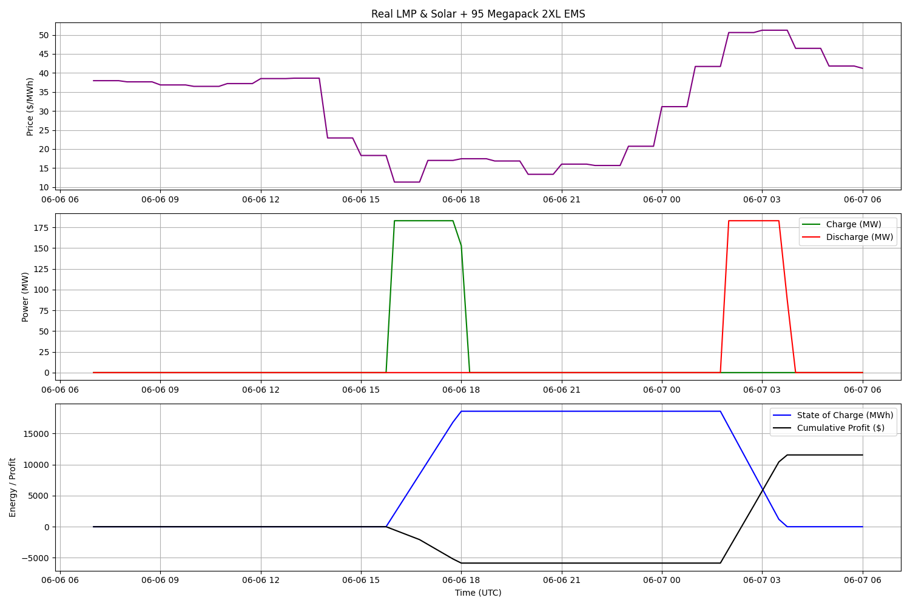

# Energy Storage Systems
In Energy Storage Systems by [Professor Sharma]([https://www.scu.edu/engineering/faculty/fr-dat-tran-s-j/](https://scholar.google.com/citations?user=2wMp1OwAAAAJ&hl=en)), I learned about intelligently managing energy storage for electrical grid infrastructure.

      
      

