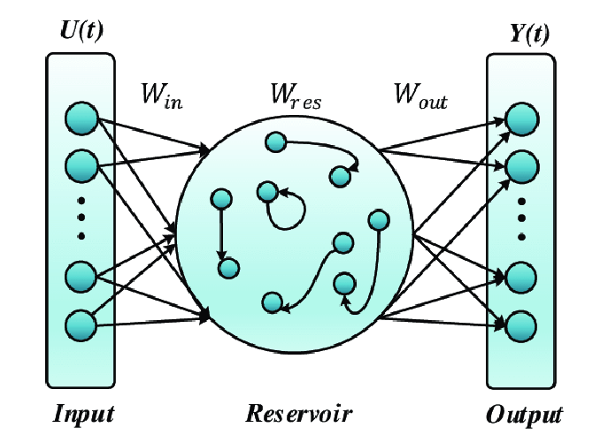

# Echo State Network

---
## Training Log Ouput

### **Dataset Initialization**  
==> Instantiating **<Mnist>**...  
...MNIST::_CheckPath()      : checking the Datasets path ...  
...Helper:GetDataPath()     : found dataset in **<\Neuromorphic Computing\Datasets>**  
...MNIST::_BuildDataVectors(): building MNIST training and testing Datasets...  
...MNIST::_TrainingAndTestingSets(): loading MNIST Datasets...  
...MNIST::_ReadMNISTData()  : loading MNIST Datasets...  

---

### **Loading MNIST Data**  
...MNIST::_LoadMNIST()      : loading **<Training>** Datasets from **<\Neuromorphic Computing\Datasets\MNIST>**...  
...MNIST::_LoadMNIST()      : loading **<Testing>** Datasets from **<\Neuromorphic Computing\Datasets\MNIST>**...  
...MNIST::_SelectSubset()   : set Datasets indices ...  
...MNIST::_GetClassGroupIndices(): set class indices for **<(60000,)>**...  
...MNIST::_SelectSubset()   : set Datasets indices ...  
...MNIST::_GetClassGroupIndices(): set class indices for **<(10000,)>**...  
...MNIST::_BuildDataVectors(): saving Datasets to file **<\Neuromorphic Computing\Datasets\MNIST_Train_10000_Test_1000.npz>**...  

---

### **Final Dataset Configuration**  
==> Instantiating **<Mnist>**...  
...MNIST::__init__()        : **Datasets location** = **\Neuromorphic Computing\Datasets**  
...MNIST::__init__()        : **Classes** = 10, **Total trains** = 60000, **Total tests** = 10000  
...MNIST::__init__()        : **DataFile** = **\Neuromorphic Computing\Datasets\MNIST_Train_10000_Test_1000.npz**  
...MNIST::__init__()        : **Epochs** = 1, **Num Trains** = 10000, **Num Tests** = 1000, **Vector Length** = 784  
...MNIST::__init__()        : **ScaleVal** = 1.0, **ZeroMeanFlag** = False  

---

### **Preprocessing & Training**  
...MNIST::GetDataVectors()  : loading MNIST dataset, **ZeroMean = <False>**...  
...MNIST::_NormalInputDataTorch(): loading and scaling MNIST Datasets to **<1.0>**...  

---

### **Training the ESN Network**  
...ESN::TrainReservoir()    : train ESN network ...  
...ESN::_ReservoirStates()  : get reservoir states ...  
**100% (9999 of 9999) |####################| Elapsed Time: 0:00:07 Time:  0:00:07**  

---

### **Testing the ESN Network**  
...ESN::TestReservoir()     : test ESN network ...  
...ESN::_ReservoirStates()  : get reservoir states ...  
**100% (999 of 999) |######################| Elapsed Time: 0:00:00 Time:  0:00:00**  

---

### **Final Classification Accuracy**  
**Classification = 92.00%** 🎯  
