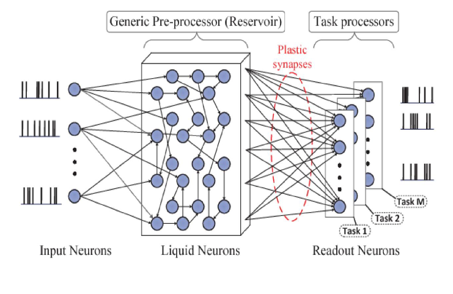

# Liquid State Machine

---
## Training Log Output

### Dataset Loading
...__main__                 : loading Datasets from <\PycharmProjects\Neuromorphic Computing\Datasets> ...  
...__main__                 : caching Datasets to <./cache\nmnist\train> and <./cache\nmnist\test> ...  
...__main__                 : running with <cpu> device  
...__main__                 : average fan out = <14.1720> ...  

---

### **Training Process**
...__main__                 : running train batches ...  
/ |         #                                        |  24  Elapsed Time: 0:03:00  train batches completed:  24  
_ |                #                                 |  49  Elapsed Time: 0:06:11  train batches completed:  49  
\ |                         #                        |  74  Elapsed Time: 0:09:22  train batches completed:  74  
| |                                      #           |  99  Elapsed Time: 0:12:33  train batches completed:  99  
/ |                                                # | 124  Elapsed Time: 0:15:45  train batches completed: 124  
_ |                #                                | 149  Elapsed Time: 0:18:58  train batches completed: 149  
\ |                    #                            | 174  Elapsed Time: 0:22:10  train batches completed: 174  
| |                                                # | 199  Elapsed Time: 0:25:23  train batches completed: 199  
/ |                       #                         | 224  Elapsed Time: 0:28:37  train batches completed: 224  
| |     #                                           | 234  Elapsed Time: 0:29:52  

---

### **Training Summary**
...__main__                 : running time of training epoch = <1798.3510> ...  

---

### **Testing Process**
...__main__                 : running test batches ...  
/ |                                 #                |  24  Elapsed Time: 0:03:23  test batches completed:  24  
| |                                        #         |  39  Elapsed Time: 0:05:25  

---

### **Spiking Statistics**
...__main__                 : mean in spiking (train) = <0.00451575> ...  
...__main__                 : mean in spiking (test) = <0.00454212> ...  
...__main__                 : mean LSM spiking (train) = <0.54636413> ...  
...__main__                 : mean LSM spiking (test) = <0.54675174> ...  

---

### **Final Test Score**
...__main__                 : training output layer ...  
...__main__                 : test score = <0.9757> ... 🎯 
---
