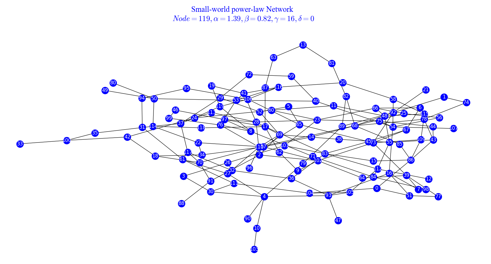
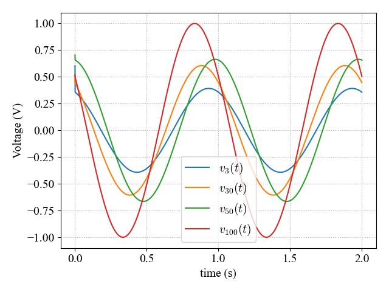
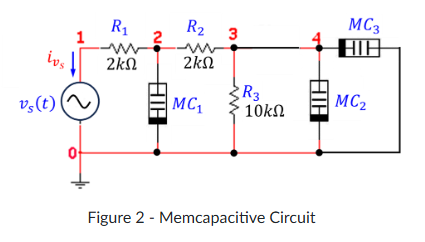
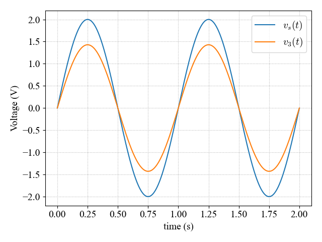
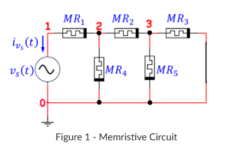
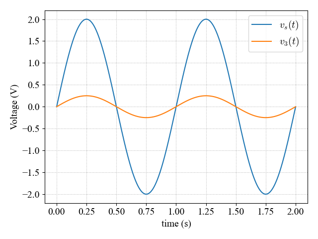

# Small World Power Law Network

A neural network configured to model neuron patterns in the human brain.

---

I combined my Mem-Device models with mixed nodal analysis of a small world power law network to model the voltages at each neuron, nodes 3, 30, 50, and 100 are graphed here.

---
# Memcapacitive Circuit

      
      

---
# Memristive Circuit

      
      

