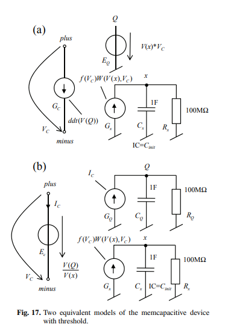

# I tried to replicate Biolek's C4 model for a Bipolar Memcapacitive System with Threshold

[Source](https://www.researchgate.net/publication/248382146_Reliable_SPICE_Simulations_of_Memristors_Memcapacitors_and_Meminductors?enrichId=rgreq-2607b716844d0292c7f8da1254780775-XXX&enrichSource=Y292ZXJQYWdlOzI0ODM4MjE0NjtBUzoxMTEyNDA5MTk2NTQ0MDBAMTQwMzUzMzMxMTE3MA%3D%3D&el=1_x_3&_esc=publicationCoverPdf)

This is a version of the C4 model (4.4, Fig. 17.b) I made based off of Biolek's code and equations (48, 49, 50, 51) from his paper, but I could not successfully duplicate his results (Fig. 18).

  
  

The Rp resistor (10m Ohm) is in parallel to the memcapacitor, which provides a low impedance path for allowing leakage current to flow. It also fixes the Spice requirement that their must be a DC path to ground.

With Biolek's model there is a notable hysteresis response, but it is not precise. This is likely a consequence of the internal state variable x only downstepping, when it should be a square wave. Charge is also different from expected, as it is perfectly sinusoidal, when it should have periodical pauses.

To try and identify what was going wrong with the model, I compared my code with Biolek's, as well as with the equations, but found no errors. I also tried adjusting the parameters, but this was not solving the problems.
After asking GPT, it gave me the code in test.sp. This modifies Biolek's equations, using a signum function in f to force the symmetrical scaling of the variables, so that x can reach the desired square behavior. W was also modified so that the up and down steps of x are equivalent. Consequently, we can see improvement in the internal state of x as it is now periodically increasing and decreasing as we expected, but not in the square wave function we are expecting. Charge Q has also improved as in the first cycle we see the sinusoid pause slightly.

This led me to believe that the parameters now had to be scaled differently, however the only change that made notable difference was to the threshold voltage. I found that when we change the threshold voltage to zero, there was a major improvement. Charge is now modeled equivalently to Biolek's model, and there is now a stable hysteresis response not differing much in scale from that of Biolek's model, but in opposite polarity. While X is now periodical, it is sinusoidal rather than square as we would expect.

I cannot explain why implementing Biolek's equations led to a different response in the model, it could have been in how I integrated the memcapacitor into the parallel circuit or could possibly be from using a different version of spice.
