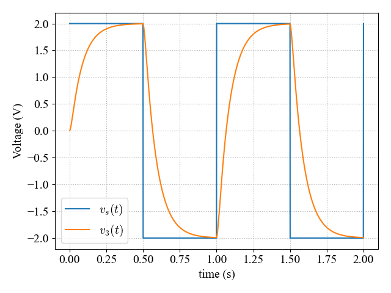

      
      

Ax = Z      A - Coefficient Matrix, x - Dependent Variables, Z - Independent Sources

# Netlist and Matrices

## Netlist

| DEV | N1 | N2 | VAL |
|-----|----|----|----------------|
| VS  | 1  | 0  | 1.000000       |
| R1  | 1  | 2  | 2000.000000    |
| R2  | 2  | 3  | 4000.000000    |
| C1  | 2  | 0  | 0.000008       |
| C2  | 3  | 0  | 0.000012       |
| C3  | 3  | 4  | 0.000010       |
| R3  | 0  | 4  | 5000.000000    |

## Matrix A (Symbolic)
| 0       | 1        | 2        | 3        | 4  |
|---------|-----------------------|-----------------------------|----------|---|
| 1/R1    | -1/R1                 | 0                           | 0        | 1 |
| -1/R1   | C1/dt + 1/R2 + 1/R1   | -1/R2                       | 0        | 0 |
| 0       | -1/R2                 | C2/dt + C3/dt + 1/R2        | -C2/dt   | 0 |
| 0       | 0                     | -C2/dt                      | C3/dt + 1/R3 | 0 |
| 1       | 0                     | 0                           | 0        | 0 |

## Matrix A (Numerical)

| 0       | 1        | 2        | 3        | 4  |
|---------|---------|---------|---------|----|
| 0.0005  | -0.0005 | 0.0000  | 0.0000  | 1.0 |
| -0.0005 | 0.0087  | -0.0002 | 0.0000  | 0.0 |
| 0.0000  | -0.0002 | 0.0222  | -0.0099 | 0.0 |
| 0.0000  | 0.0000  | -0.0099 | 0.0101  | 0.0 |
| 1.0000  | 0.0000  | 0.0000  | 0.0000  | 0.0 |

## Vector X

| Symbol | Value  |
|-------|--------|
| V1     | 1.000000 |
| V2     | 0.057202 |
| V3     | 0.001150 |
| V4     | 0.001127 |
| IV1    | -0.000471 |

## Vector Z

| Symbol | Value  |
|-------|---------------------------------------------------------------|
| Gnd                                                         | 0.0  |
| C1/dt * V2Prev                                              | 0.0  |
| C2/dt * V3Prev + C3/dt * (V3Prev - V4Prev)                  | 0.0  |
| C3/dt * (-V3Prev + V4Prev)                                  | 0.0  |
| VS                                                          | 1.0  |
